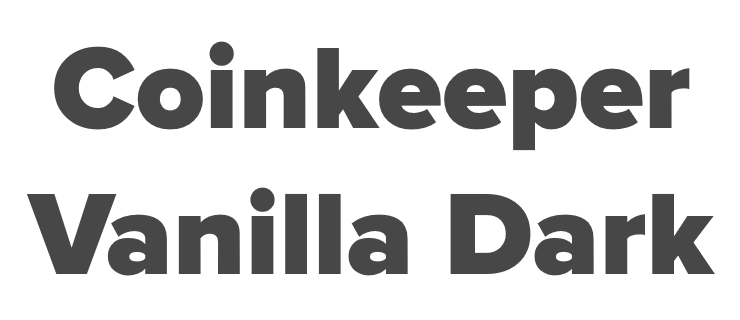

  
   
  
  
  

## Preview

## Installation
1. Install Stylus
([ Chrome](https://chrome.google.com/webstore/detail/stylus/clngdbkpkpeebahjckkjfobafhncgmne),
[ Firefox](https://addons.mozilla.org/en-US/firefox/addon/styl-us/),
[ Opera](https://addons.opera.com/en-gb/extensions/details/stylus/)).

1. Install the style using one of these methods: 
   * [Install from userstyles.org](https://userstyles.org/styles/165830)
   * [Install directly with Stylus](https://github.com/VChet/Coinkeeper-Dark/raw/master/coinkeeper-dark.user.css)

## Contribute
Anyone and everyone is welcome to [contribute](https://github.com/VChet/Coinkeeper-Dark/pulls) and report any [issues](https://github.com/VChet/Coinkeeper-Dark/issues).

## Development
1. [Fork](https://github.com/VChet/Coinkeeper-Dark/fork) and download this repository
1. Install [Node.js](https://nodejs.org/)
1. Install all dependencies using `npm install`
1. Change [mappings](./tools/generate.js)
1. Generate style with `npm run generate`
1. Make additional changes in `coinkeeper-dark.user.css` if needed
1. Commit and push your changes
1. Make a pull request
