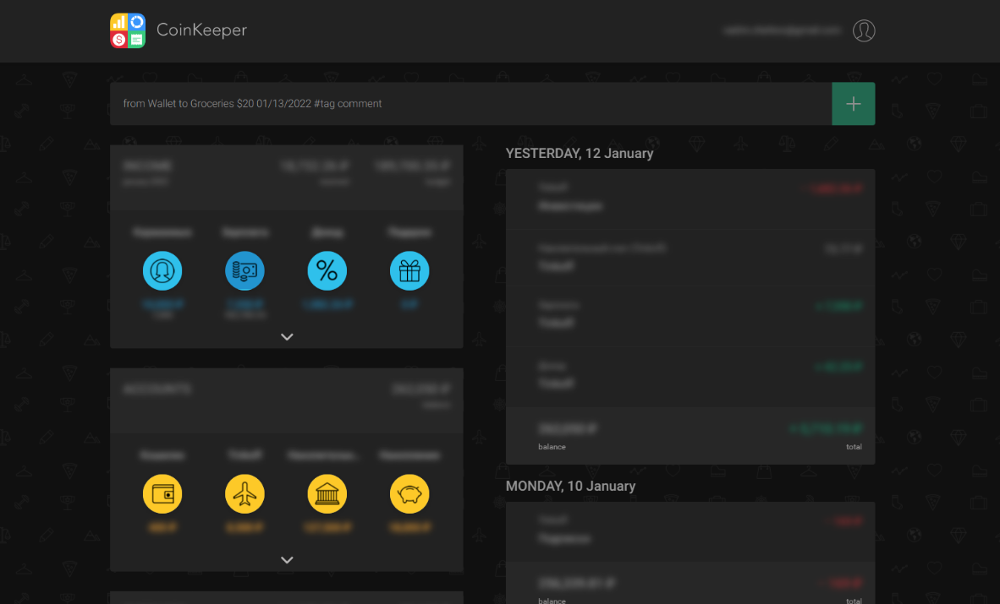

  
   
  
  
  
  

## Preview

## Installation

1. Install Stylus/Cascadea (Safari)
   - [ Chrome](https://chrome.google.com/webstore/detail/stylus/clngdbkpkpeebahjckkjfobafhncgmne)
   - [ Firefox](https://addons.mozilla.org/en-US/firefox/addon/styl-us/)
   - [ Safari](https://cascadea.app/)
1. [Install UserCSS](https://github.com/VChet/coinkeeper-dark/raw/master/src/coinkeeper-dark.user.css)

## Contribute

Anyone and everyone is welcome to [contribute](https://github.com/VChet/coinkeeper-dark/pulls) and report any [issues](https://github.com/VChet/coinkeeper-dark/issues).

## Development

1. [Fork](https://github.com/VChet/coinkeeper-dark/fork) and download this repository
1. Install [Node.js](https://nodejs.org/)
1. Install all dependencies using `npm install`
1. Change [mappings](./src/mappings.js)
1. Generate style with `npm run build`
1. Make additional changes in [main style](./src/coinkeeper-dark.user.css) if needed
1. Commit and push your changes
1. Make a pull request
